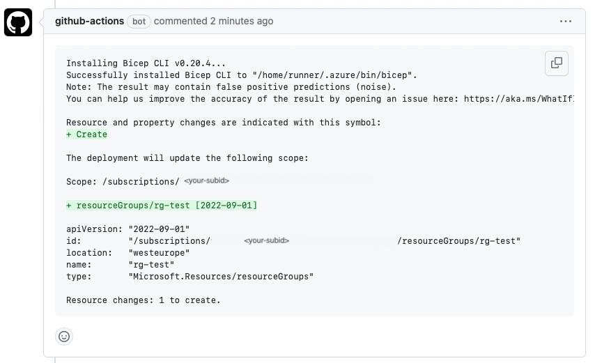

# 🦾 Bicep - Colorize `What-if` in Pull Request

This GitHub Action automatically triggers when a pull request is made. It executes the Bicep what-if command to preview potential changes to Azure resources. The results are then colorized to enhance readability and clarity, and posted directly as a comment on the pull request, leveraging GitHub's built-in capabilities. This provides developers with an immediate visual insight into how their Bicep code modifications might affect the associated Azure infrastructure.

## When to use

The action is useful for Continuous Integration scenarios where you want the approver to have the ability to review the `what-if` results before the code is merged into the main branch.

#### Example output



## Getting Started

### Prerequisites

- `pull-request: write`:
  - permission on the runner as this action will post a comment on a pull request
- `contents: read`:
  - Allows the workflow to read the contents of the repository.
- `id-token: write`:
  - This is generally used to obtain an ID token for the GITHUB_TOKEN, which in turn can be used to authenticate in a workflow run. This is a more specialized permission and is typically not needed for most workflows unless you're specifically dealing with authentication mechanisms that require the ID token. In this example I'm using Azure Login with OpenID Connect and it's therefor required.

### Usage

```yml
steps:
  - name: Bicep Colorized PR
    uses: simenwo/bicep-colorize-pr@1.0.0
    with:
      location: westeurope
      template-file: main.bicep
      parameters-file: main.bicepparam
      token: ${{ secrets.GITHUB_TOKEN }}
```

### Inputs

| Name              | Description                                      | Required | Default value      |
| ----------------- | ------------------------------------------------ | -------- | ------------------ |
| `location`        | Location of the deployment                       | true     |                    |
| `template-file`   | Bicep template file                              | true     | `./main.bicep`     |
| `parameters-file` | Bicep parameters file                            | true     | `./main.biceparam` |
| `token`           | GITHUB_TOKEN secret to authenticate the workflow | true     |                    |

### Example workflow

- **OpenID Connect Authentication**: This workflow uses OpenID Connect to authenticate with Azure. Ensure you've set up OIDC authentication for your GitHub repository and Azure. More information: [Authenticate from Azure to GitHub](https://learn.microsoft.com/en-us/azure/developer/github/connect-from-azure?tabs=azure-portal%2Clinux)

- **Environment Secrets**: Ensure you have the following secrets set up in your GitHub repository:

  - `ARM_TENANT_ID`
  - `ARM_SUBSCRIPTION_ID`
  - `ARM_CLIENT_ID`

- **Bicep Linting and Validation**: It's recommended to execute linting and validation checks on your Bicep templates before using this workflow. This ensures the integrity and correctness of your Bicep code. You can use the `bicep lint` and `bicep build` commands respectively.

- **Workflow Trigger**: This workflow is designed to be triggered on pull requests targeting the `main` branch.

```yml
name: Bicep Colorize PR
on:
  pull_request:
    branches:
      - main

permissions:
  pull-request: write
  id-token: write
  contents: read

env:
  ARM_TENANT_ID: ${{ secrets.ARM_TENANT_ID }}
  ARM_SUBSCRIPTION_ID: ${{ secrets.ARM_SUBSCRIPTION_ID }}
  ARM_CLIENT_ID: ${{ secrets.ARM_CLIENT_ID }}

jobs:
  preview:
    runs-on: ubuntu-latest
    steps:
      - uses: actions/checkout@v3
      - uses: azure/login@v1
        name: Sign in to Azure
        with:
          client-id: ${{ env.ARM_CLIENT_ID }}
          tenant-id: ${{ env.ARM_TENANT_ID }}
          subscription-id: ${{ env.ARM_SUBSCRIPTION_ID }}

      - name: Load Result
        uses: simenwo/bicep-colorize-pr@v1
        with:
          location: westeurope
          template-file: main.bicep
          parameters-file: main.bicepparam
          token: ${{ secrets.GITHUB_TOKEN }}
```

# Contributing

This project welcomes contributions and suggestions.
For further information look at the [contribution.md](CONTRIBUTING.md) file.
